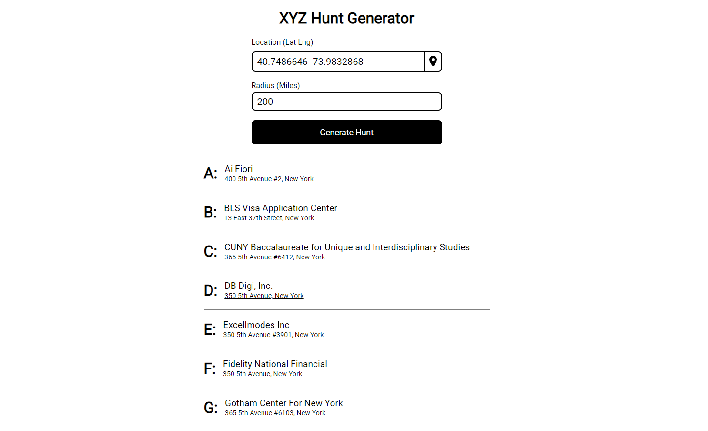

# XYZ Hunt Generator

## What is an XYZ Hunt?
* An XYZ hunt is a scavenger hunt where participants travel around an area searching for businesses with names that start with each letter of the alphabet and photograph themselves with the sign at each business. 

## How does it work? 
* Enter your latitude and longitude or let the app locate you, enter a radius in miles and hit search.
* The app will use the google maps api to find locations nearby with names that begin with each letter of the alphabet.



## How to run locally?
* Clone the repository and ```npm run start``` in both the server and client folder. 
* You will need to paste a valid google maps api key into the server's .env file for the app to function.